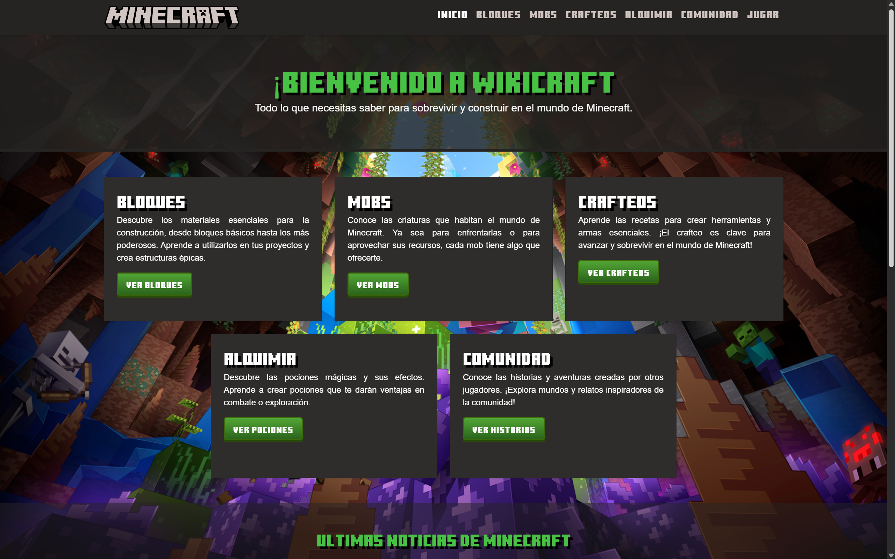
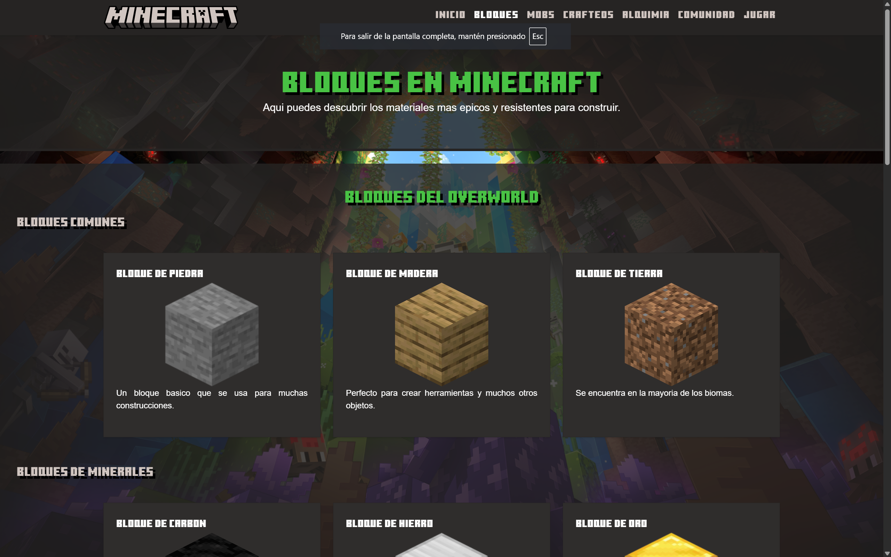
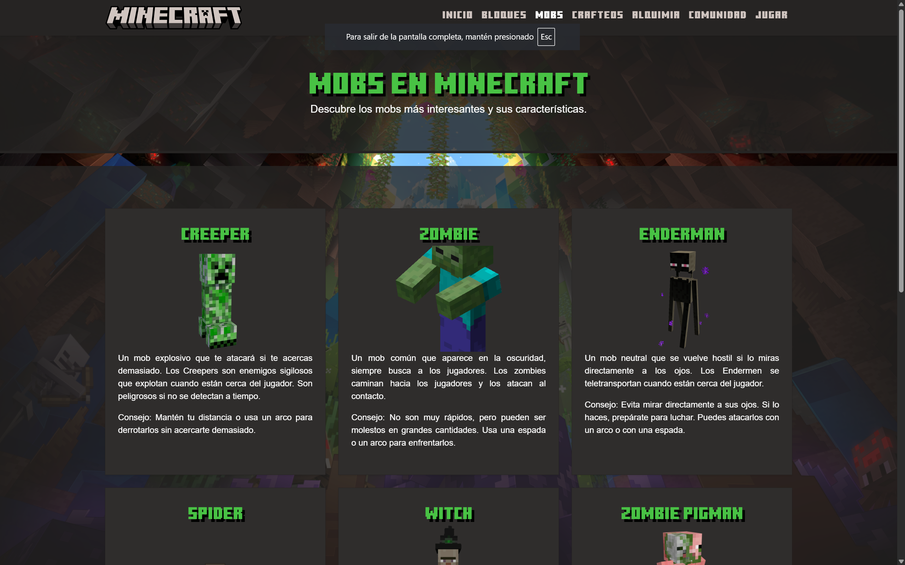
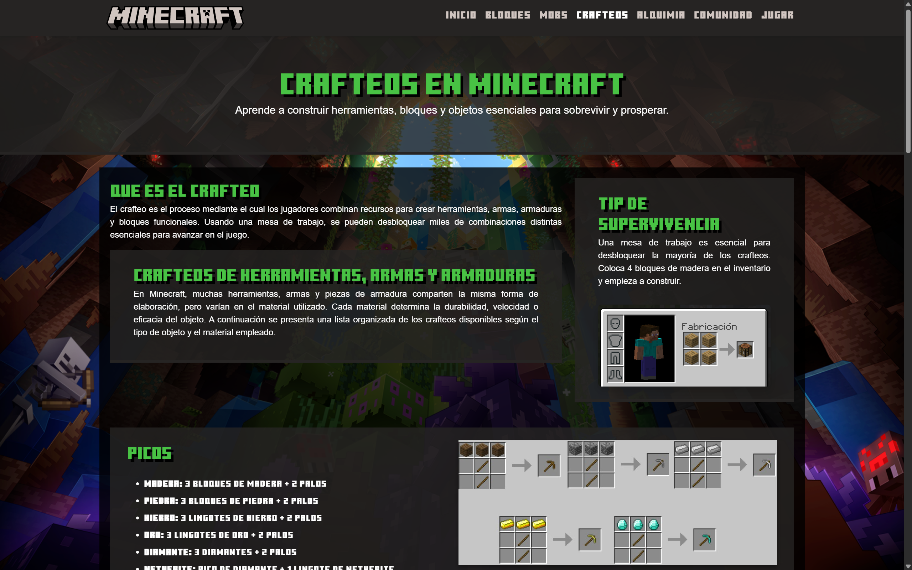
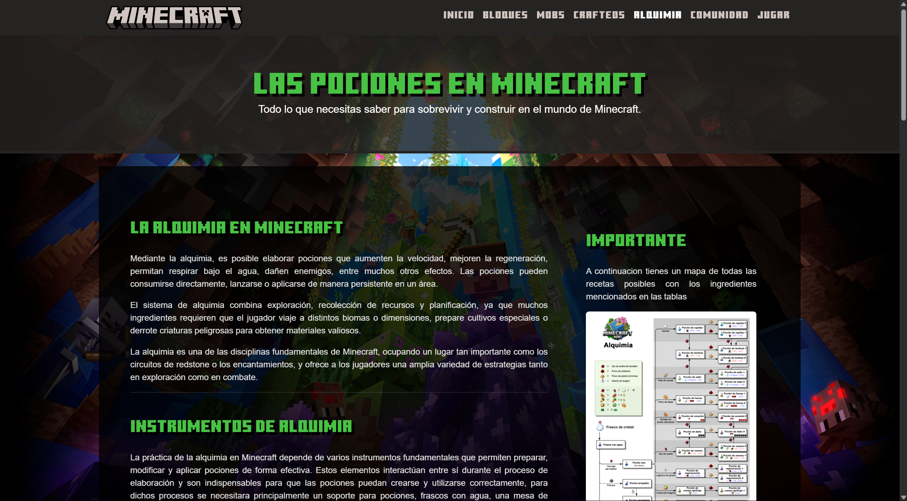
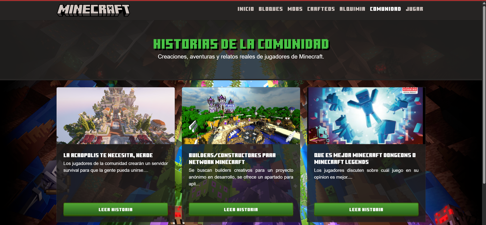

# 💎 WikiCraft — La Enciclopedia Definitiva de Minecraft

[](https://www.minecraft.net/)
[](https://opensource.org/licenses/MIT)

**WikiCraft** no es solo una base de datos; es tu compañero esencial para sobrevivir, construir y dominar el mundo de los bloques. Un portal interactivo diseñado para aventureros que buscan información rápida, precisa y con una estética fiel al juego.

---

## 🚀 ¡Pruébalo Ahora!

¿Listo para explorar? Visita la versión en vivo:
👉 **[WikiCraft en GitHub Pages](https://kiramman-mp3.github.io/WikiCraft/)** 👈

---

## ✨ Características Principales

### ⚒️ Domina los Bloques
Aprende sobre cada material, desde la humilde tierra hasta la poderosa netherita. Descubre sus usos, resistencia y dónde encontrarlos.

### 🧟 Conoce a tus Vecinos (y Enemigos)
Guía completa de Mobs. Estrategias de combate para Creepers y consejos para criar Aldeanos. ¡No dejes que el Warden te sorprenda!

### 📜 El Arte del Crafteo
Recetario interactivo con todo lo que necesitas para fabricar herramientas, armaduras y decoraciones épicas.

### 🧪 Alquimia Maestra
Conviértete en un experto en pociones. Guías paso a paso para destilar los efectos más poderosos del juego.

### 📡 Últimas Noticias de la Comunidad
Integración en tiempo real con lo mejor de la comunidad de Minecraft en Reddit. ¡Mantente al día con las actualizaciones y secretos!

---

## 📸 Galería del Proyecto

| Inicio | Bloques | Mobs |
| :---: | :---: | :---: |
|  |  |  |

| Crafteos | Alquimia | Comunidad |
| :---: | :---: | :---: |
|  |  |  |

---

## 🛠️ Tecnologías

WikiCraft está construido con lo último en estándares web para ofrecer una experiencia fluida y visualmente "pixel-perfect":

- **Core**: HTML5, JavaScript (ES6+).
- **Estilo**: CSS3 (con un tema oscuro personalizado de Minecraft) y Bootstrap 5.
- **Flujo de Trabajo**: GitFlow para un desarrollo profesional y organizado.

---

## 🎮 Instalación Local

Si prefieres correr WikiCraft en tu propio "servidor" local:

1. **Clona el reino:**
   ```bash
   git clone https://github.com/kiramman-mp3/WikiCraft.git
   ```
2. **Entra al directorio:**
   ```bash
   cd WikiCraft
   ```
3. **¡A jugar!**
   Simplemente abre el archivo `index.html` en tu navegador favorito.

---

## 🤝 Uniendo Fuerzas (Contribuciones)

¿Quieres ayudarnos a mejorar WikiCraft? ¡Eres bienvenido!

1. Realiza un **Fork** de este proyecto.
2. Crea tu rama de características (`git checkout -b feature/EpicFeature`).
3. Haz **Commit** de tus cambios.
4. Abre un **Pull Request** y cuéntanos sobre tu mejora.

---

## 👑 El Equipo de Desarrollo

Este proyecto fue forjado con pasión por:

- **Alexis López**
- **José Manzano**
- **Alan Puruncajas**
- **Johan Rodríguez**
- **Juan Pablo Vayas**

---

*Desarrollado con ❤️ para la comunidad de Minecraft.*
